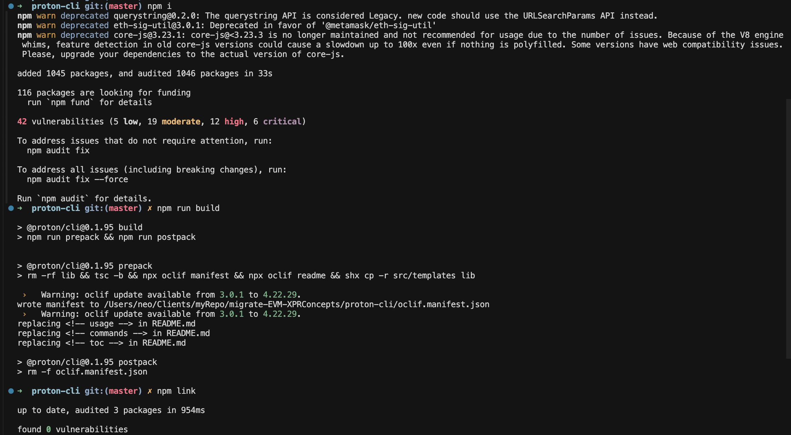
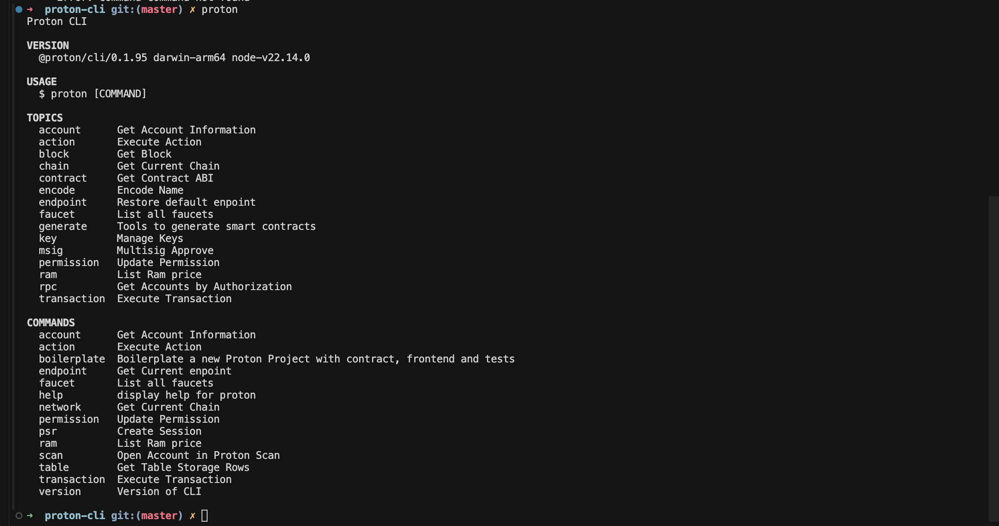

# Proton CLI Setup Guide

## Quick Setup

### Step 1: Clone and Build

```bash
# Clone Proton CLI repository
git clone https://github.com/ProtonProtocol/proton-cli.git
cd proton-cli

# Install dependencies and build
npm install
npm run build
npm link
```

### Step 2: Verify Installation

```bash
# Check installation
proton --version
proton --help
```

### Step 3: Configure Network

```bash
# Set to testnet for development
proton chain:set proton-test
```

### Step 4: Generate Keys

```bash
# Generate key pair using Proton CLI
proton key:generate

# Or use external tools
cleos create key --to-console

# Or use online key generator
# Visit: https://nadejde.github.io/eos-token-sale/
```

### Step 5: Create Account

```bash
# Create account (interactive mode)
proton account:create myaccount

# Account creation will prompt for key selection
```

## Visual Guide

### Installation Process



### Proton Commands



## Common Commands

| Command | Description | Example |
|---------|-------------|---------|
| `proton --version` | Check version | `proton --version` |
| `proton chain:set` | Set network | `proton chain:set proton-test` |
| `proton key:generate` | Generate key | `proton key:generate` |
| `proton account:create` | Create account | `proton account:create myaccount` |
| `proton contract:set` | Deploy contract | `proton contract:set myaccount ./target` |
| `proton action` | Call action | `proton action myaccount sayhello '[]' myaccount@active` |

## Troubleshooting

### Build Issues
```bash
# Clear cache and rebuild
npm cache clean --force
rm -rf node_modules package-lock.json
npm install
npm run build
npm link
```

### Permission Issues
```bash
# Fix npm permissions
sudo chown -R $(whoami) ~/.npm
sudo chown -R $(whoami) /usr/local/lib/node_modules
```

### Network Issues
```bash
# Check network status
proton chain:get

# Reset network
proton chain:set proton-test
```

## Next Steps

1. Complete Proton CLI setup
2. Generate or import keys
3. Create test account
4. Proceed to Exercise 1: Hello World

---

**Ready to start? Let's build your first smart contract!**
